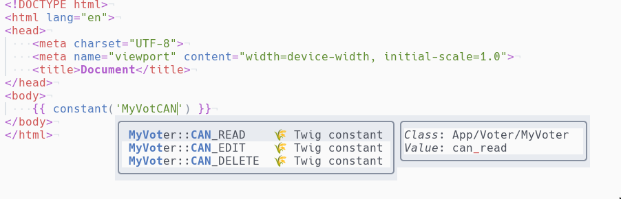

# cmp-twig-constants

[nvim-cmp](https://github.com/hrsh7th/nvim-cmp) source for twig.  
This plugin autocompletes PHP constants located in src directory for twig.  



Output is:  
```twig
constant('App\\Voter\\MyVoter::CAN_EDIT')
```

Constants are refreshed every 60 seconds.

## Prerequisites
- [ripgrep](https://github.com/BurntSushi/ripgrep) to search for 
PHP constants.

## Setup

```lua
require('cmp').setup({
  sources = {
    { name = 'twig_constants' },
  },
})
```

## Triggers

The plugin is activated for `twig` filetype only.  
The trigger character is a single quote, and the line must contains `constant`.

## Configuration

There is no configuration at the moment.

## Todo

- Make sure cursor is between quotes
- Follow composer autoload
